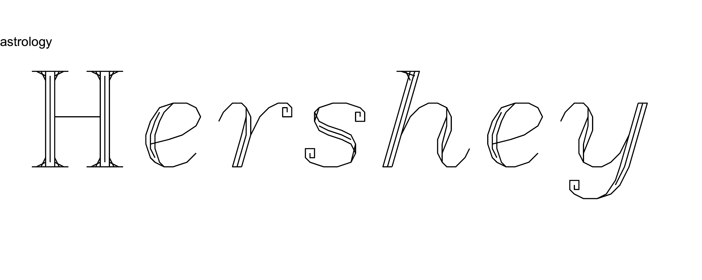

<!-- README.md is generated from README.Rmd. Please edit that file -->

```{r, include = FALSE}
knitr::opts_chunk$set(
  collapse = FALSE,
  comment = "#>",
  fig.path = "man/figures/README-",
  out.width = "100%"
)

library(hershey)
library(ggplot2)
library(dplyr)
```


```{r echo = FALSE, eval = FALSE}
# Quick logo generation. Borrowed heavily from Nick Tierney's Syn logo process
library(magick)
library(showtext)
font_add_google("Abril Fatface", "gf")


# pkgdown::build_site(override = list(destination = "../coolbutuseless.github.io/package/hershey"))
```


```{r echo=FALSE, eval=FALSE}
plot_df <- hershey %>% 
  filter(font == 'rowmant', char == 'H') 
  
p <- ggplot(plot_df) +  
  geom_path(aes(x, y, group = stroke, colour = stroke), size = 1) + 
  geom_point(aes(x, y)) +
  coord_equal() + 
  theme_void() +
  theme(legend.position = 'none') 

print(p)

ggsave("man/figures/stroke-logo.png", plot = p, width = 4, height = 4)
```


```{r echo = FALSE, eval = FALSE}
img <- image_read("man/figures/stroke-logo.png") %>%
  image_transparent(color = "#f9fafb", fuzz = 10) %>%
  image_trim() %>%
  image_threshold()


hexSticker::sticker(subplot  = img,
                    s_x      = 1,
                    s_y      = 1.2,
                    s_width  = 1.5,
                    s_height = 0.95,
                    package  = "hershey",
                    p_x      = 0.98,
                    p_y      = 0.55,
                    p_color  = "#223344",
                    p_family = "gf",
                    p_size   = 8,
                    h_size   = 1.2,
                    h_fill   = "#ffffff",
                    h_color  = "#223344",
                    filename = "man/figures/logo.png")

image_read("man/figures/logo.png")
```


# hershey   

<!-- badges: start -->

<!-- badges: end -->

The `hershey` package contains the [Hershey vector fonts](https://en.wikipedia.org/wiki/Hershey_fonts) in a number of formats for more convenient use within Rstats.

The Hershey fonts were developed in the 1960s.  Each glyph is defined as collections of staight line segments - hand calculated by Hershey by sketching them on grid paper!

This package makes available the coordinates of the stroke endpoints for every glyph.

You may need this package if:

* you like retro vector fonts
* you need a vector font so you can have complete control of the output


```{r example_header, out.width = "50%", fig.width=4, echo = FALSE}
hershey %>% 
  filter(font == 'rowmant', char == 'H') %>%
  ggplot(aes(x, y, group = stroke)) + 
  geom_path() + 
  geom_point() + 
  coord_equal() + 
  theme_minimal() 
```


```{r echo = FALSE, eval=FALSE}
library(ggplot2)

fontnames <- unique(hershey$font)
fontnames <- setdiff(fontnames, c('japanese', 'japanese2', 'markers', 'mathlow', 
                                  'mathupp', 'symbolic', 'gothitt', 'greek', 
                                  'greekc', 'greeks', 'timesg', 'cyrilc_1',
                                  'cyrillic', 'gothgrt', 'gothgbt', 'scripts'))

for (idx in seq_along(fontnames)) {
  text <- 'Hershey'
  font <- fontnames[idx]
  print(font)
  
  string_df <- create_string_df(text = text, font = font)
  
  p <- ggplot(string_df) +
    geom_path(aes(x, y, group = interaction(char_idx, stroke))) +
    coord_equal(xlim = c(-10, 130), ylim = c(-25, 15)) +
    theme_void() +
    # theme_minimal() + 
    labs(title = font)
  
  filename <- paste0("man/figures/fontname/", font, ".png")
  ggsave(filename, p, width = 10, height = 4)
}

system("convert -delay 200 man/figures/fontname/*.png man/figures/fontname/anim.gif")
system("gifsicle man/figures/fontname/anim.gif --colors 4 > man/figures/fontname/animo.gif")

unlink("man/figures/fontname/anim.gif")
```


```{r echo = FALSE, eval=FALSE}
text <- '#RStats'
font <- 'cursive'
dir.create('man/figures/rstats/', showWarnings = FALSE, recursive = TRUE)

string_df <- create_string_df(text = text, font = font)


for (ii in seq(1, nrow(string_df), 2)) {
  plot_df <- string_df %>% slice(seq(ii))
  
  p <- ggplot(plot_df) +
    geom_path(aes(x, y, group = interaction(char_idx, stroke))) +
    coord_equal(xlim = c(-10, 100), ylim = c(-15, 15)) +
    theme_minimal() + 
    theme(axis.title.x = element_blank(), axis.title.y = element_blank())
  
  filename <- sprintf("man/figures/rstats/%s-%03i.png", font, ii)
  ggsave(filename, p, width = 4, height = 1.3)
}

system("convert -delay 5 man/figures/rstats/*.png man/figures/rstats/anim.gif")
system("convert man/figures/rstats/anim.gif \\( +clone -set delay 500 \\) +swap +delete  man/figures/rstats/animpause.gif")
system("gifsicle man/figures/rstats/animpause.gif --colors 4 > man/figures/rstats/animo.gif")

unlink("man/figures/rstats/anim.gif")
unlink('man/figures/rstats/animpause.gif')
```


```{r echo = FALSE, eval=FALSE}
text <- 'Hershey'
font <- 'cursive'


string_df <- create_string_df(text = text, font = font)

for (ii in seq(1, nrow(string_df), 2)) {
  plot_df <- string_df %>% slice(seq(ii))
  
  p <- ggplot(plot_df) +
    geom_path(aes(x, y, group = interaction(char_idx, stroke))) +
    coord_equal(xlim = c(-10, 80), ylim = c(-25, 15)) +
    theme_void()
  
  filename <- sprintf("man/figures/fontdraw/%s-%03i.png", font, ii)
  ggsave(filename, p, width = 6, height = 2)
}

system("convert -delay 10 man/figures/fontdraw/*.png man/figures/fontdraw/anim.gif")
system("convert man/figures/fontdraw/anim.gif \\( +clone -set delay 500 \\) +swap +delete  man/figures/fontdraw/animpause.gif")
system("gifsicle man/figures/fontdraw/animpause.gif --colors 4 > man/figures/fontdraw/animo.gif")

unlink("man/figures/fontdraw/anim.gif")
unlink('man/figures/fontdraw/animpause.gif')
```


```{r echo = FALSE, eval=FALSE}
text <- 'Hershey'
font <- 'timesrb'

string_df <- create_string_df(text = text, font = font)

string_df %<>% group_by(char_idx) %>% mutate(scale = row_number()/n()) %>% ungroup()

for (ii in seq(0, 1, length.out = 25)) {
  plot_df <- string_df %>% filter(scale <= ii)
  
  p <- ggplot(plot_df) +
    geom_path(aes(x, y, group = interaction(char_idx, stroke))) +
    coord_equal(xlim = c(-10, 130), ylim = c(-25, 15)) +
    theme_void()
  
  filename <- sprintf("man/figures/fontdraw2/%s-%03i.png", font, round(ii * 100))
  ggsave(filename, p, width = 6, height = 1.5)
}

system("convert -delay 10 man/figures/fontdraw2/*.png man/figures/fontdraw2/anim.gif")
system("convert man/figures/fontdraw2/anim.gif \\( +clone -set delay 500 \\) +swap +delete  man/figures/fontdraw2/animpause.gif")
system("gifsicle man/figures/fontdraw2/animpause.gif --colors 4 > man/figures/fontdraw2/animo.gif")

unlink("man/figures/fontdraw2/anim.gif")
unlink('man/figures/fontdraw2/animpause.gif')
```


<details closed>
<summary> <span title='Click to open/close' style="color: #496B80;"> Slideshow (click to open/close)</span> </summary>

</details><br />

<details closed>
<summary> <span title='Click to open/close' style="color: #496B80;"> Animated Rendering 1 (click to open/close) </span> </summary>

</details><br />

<details open>
<summary> <span title='Click to open/close' style="color: #496B80;"> Animated Rendering 2 (click to open/close) </span> </summary>

</details><br />


## Installation

You can install the development version from [GitHub](https://github.com/coolbutuseless/hershey) with:

``` r
# install.packages("devtools")
devtools::install_github("coolbutuseless/hershey")
```


## What's in the box:

* `hershey_raw`: the original encoding for every glyph (See the [vignette](https://coolbutuseless.github.io/package/hershey/articles/hershey-font-format.html) for how to parse).
* `hershey`: a data.frame of the vector strokes for every glyph.
* `hershey_svg`: a list of SVG paths for every glyph.

Vignettes

* [Animated stroke rendering](https://coolbutuseless.github.io/package/hershey/articles/animated-stroke-rendering.html)
* [How to generate a sample sheet for a font](https://coolbutuseless.github.io/package/hershey/articles/generate-sample-sheet.html)
* [Description of the raw Hershey font format](https://coolbutuseless.github.io/package/hershey/articles/hershey-font-format.html)
* [Rendering a glyph to SVG](https://coolbutuseless.github.io/package/hershey/articles/render-glyph-to-svg.html)
* [Visualise stroke order](https://coolbutuseless.github.io/package/hershey/articles/visualise-stroke-order.html)

## Glyph Representations

The following are examples of the representation of the letter `A` (glyph 34 in the `rowmant` font)

#### `hershey` - First 4 strokes in the data.frame representation

```{r}
hershey %>% 
  filter(font == 'rowmant', char == 'A') %>%
  filter(stroke %in% 0:3)
```

#### `hershey_raw` - Original encoding
```{r}
hershey_raw$rowmant[[34]]
```

#### `hershey_svg` - SVG Path version
```{r}
hershey_svg$rowmant[[34]]
```

#### Drawing strokes with `ggplot`

```{r example_rep, out.width = "50%", fig.width = 4}
hershey %>% 
  filter(font == 'rowmant', char == 'A') %>%
  ggplot(aes(x, y, group = stroke)) + 
  geom_path() + 
  geom_point() + 
  coord_equal() + 
  theme_minimal() 
```


## Font Sample Sheets

Font sample sheets show the representation of every glyph in a font. 
Click to view the sample sheets for every font in PDF format.


<details closed>
<summary> <span title='Click to open/close' style="color: #496B80;"> Example font: Cursive (click to reveal) </span> </summary>

</details><br />


```{r sample_sheets, echo=FALSE, results='asis'}
files <- list.files("man/figures/font", full.names = TRUE)
names <- tools::file_path_sans_ext(basename(files))

files <- gsub("man/figures", "reference/figures", files)

cat(paste(glue::glue("<a href='{files}'>{names}</a>"), collapse = " | "))
```


## Example: All the 'A's

```{r a}
glyph_df <- hershey %>% 
  filter(char == 'A') 
  
ggplot(glyph_df) + 
  geom_path(aes(x, y, group = stroke)) + 
  coord_equal() + 
  theme_void() + 
  facet_wrap(~font)
```


## Example: Futura!

```{r futura}
glyph_df <- hershey %>% 
  filter(font == 'futuram', glyph %in% c(32:46)) 
  
ggplot(glyph_df) + 
  geom_path(aes(x, y, group = stroke)) + 
  coord_equal() + 
  theme_void() + 
  facet_wrap(~glyph, labeller = label_both, ncol = 5)
```


## Example: Render text string

The function `create_string_df()` will create a data.frame of all the characters
in the given string.  It will offset each character by the known widths of the
preceding characters to create a well-spaced set of points.


```{r string, fig.height = 3}
string_df <- hershey::create_string_df(text = "#RStats", font = 'cursive')

ggplot(string_df, aes(x, y, group = interaction(char_idx, stroke))) +
  geom_path() +
  geom_point(size = 1) + 
  coord_equal() +
  theme_void()
```


### References

* [Wikipedia](https://en.wikipedia.org/wiki/Hershey_fonts)
* [A great presentation about Hershey and the era of the font](http://coopertype.org/event/the_hershey_fonts)
* [Paul Burke's description of the format](http://paulbourke.net/dataformats/hershey/)
* A more modern vector font by [inconvergent](https://inconvergent.net/): [gridfont](https://github.com/inconvergent/gridfont)


### Logo design
The logo is just the letter `H` from the `rowmant` font. Each stroke is coloured 
by the stroke number within the glyph and the endpoints are shown.


## Use Restrictions on Hershey Fonts

**Totally free** (except if you convert them to the proprietary US NTIS format)

<details closed>

<summary> <span title='Click to open/close' style="color: #496B80;">The following use restriction was noted in the original font distribution.</span></summary>

<pre>
    USE RESTRICTION:
    This distribution of the Hershey Fonts may be used by anyone for
    any purpose, commercial or otherwise, providing that:
    	1. The following acknowledgements must be distributed with
    		the font data:
    		- The Hershey Fonts were originally created by Dr.
    			A. V. Hershey while working at the U. S.
    			National Bureau of Standards.
    		- The format of the Font data in this distribution
    			was originally created by
    				James Hurt
    				Cognition, Inc.
    				900 Technology Park Drive
    				Billerica, MA 01821
    				(mit-eddie!ci-dandelion!hurt)
    	2. The font data in this distribution may be converted into
    		any other format *EXCEPT* the format distributed by
    		the U.S. NTIS (which organization holds the rights
    		to the distribution and use of the font data in that
    		particular format). Not that anybody would really
    		*want* to use their format... each point is described
    		in eight bytes as "xxx yyy:", where xxx and yyy are
    		the coordinate values as ASCII numbers.
</pre>
</details>
		


