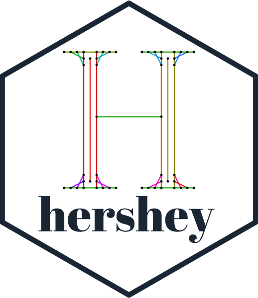
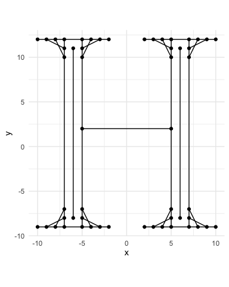
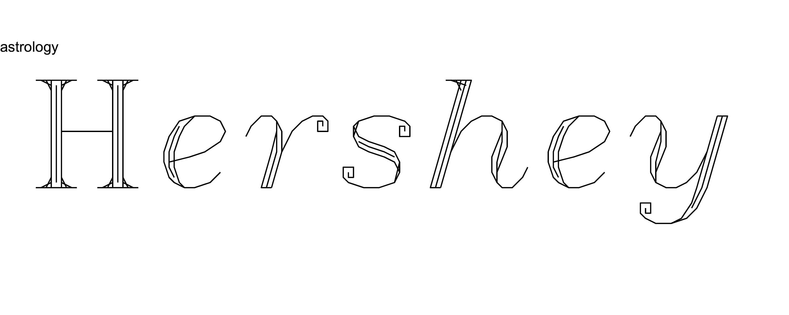
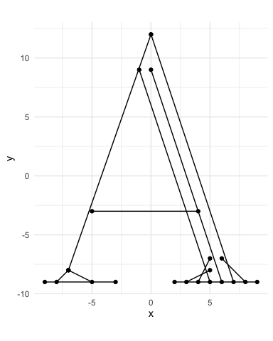
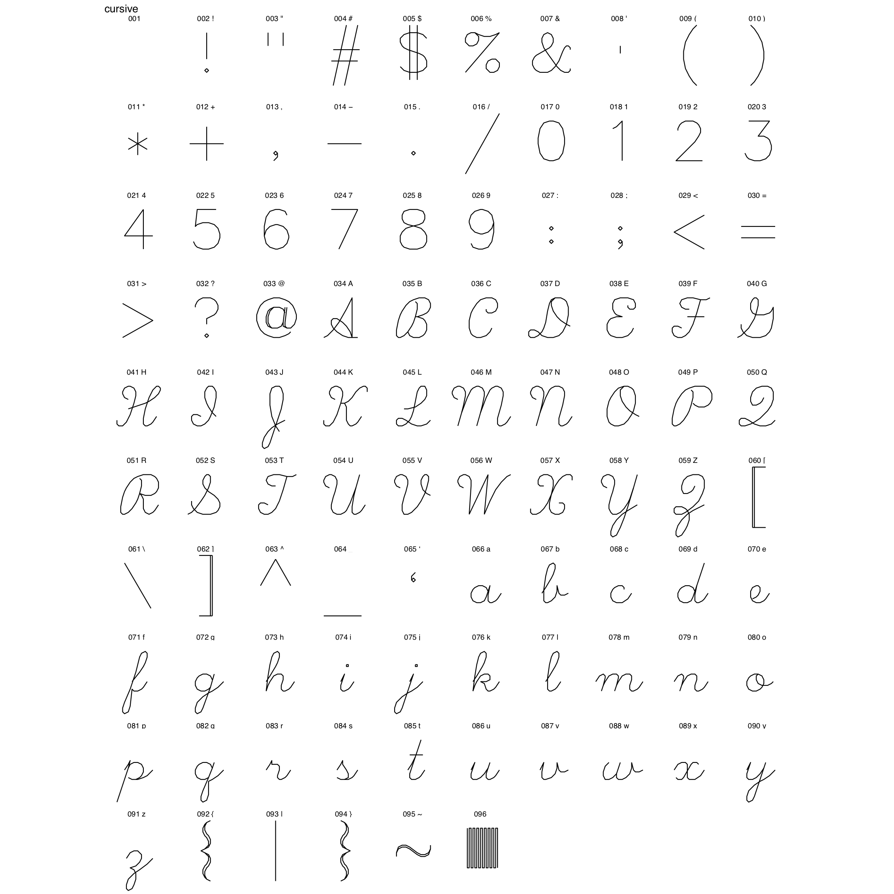
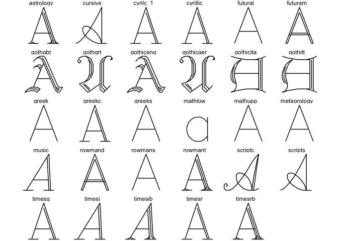
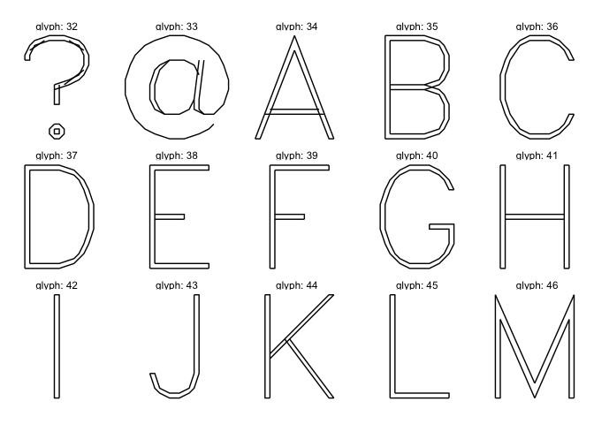
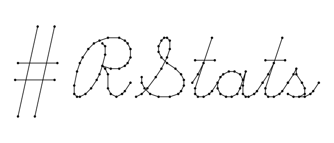

<!-- README.md is generated from README.Rmd. Please edit that file -->

# hershey 

<!-- badges: start -->

 [](https://travis-ci.org/coolbutuseless/hershey)
<!-- badges: end -->

The `hershey` package contains the [Hershey vector
fonts](https://en.wikipedia.org/wiki/Hershey_fonts) in a number of
formats for more convenient use within Rstats.

The Hershey fonts were developed in the 1960s. Each glyph is defined as
collections of staight line segments - hand calculated by Hershey by
sketching them on grid paper\!

This package makes available the coordinates of the stroke endpoints for
every glyph.

You may need this package if:

  - you like retro vector fonts
  - you need a vector font so you can have complete control of the
    output



<details closed>

<summary> <span title="Click to open/close" style="color: #496B80;">
Slideshow (click to open/close)</span> </summary>


</details>

<br />

<details closed>

<summary> <span title="Click to open/close" style="color: #496B80;">
Animated Rendering 1 (click to open/close) </span> </summary>


</details>

<br />

<details open>

<summary> <span title="Click to open/close" style="color: #496B80;">
Animated Rendering 2 (click to open/close) </span> </summary>


</details>

<br />

## Installation

You can install the development version from
[GitHub](https://github.com/coolbutuseless/hershey) with:

``` r
# install.packages("devtools")
devtools::install_github("coolbutuseless/hershey")
```

## What’s in the box:

  - `hershey_raw`: the original encoding for every glyph (See the
    [vignette](https://coolbutuseless.github.io/package/hershey/articles/hershey-font-format.html)
    for how to parse).
  - `hershey`: a data.frame of the vector strokes for every glyph.
  - `hershey_svg`: a list of SVG paths for every glyph.

Vignettes

  - [Animated stroke
    rendering](https://coolbutuseless.github.io/package/hershey/articles/animated-stroke-rendering.html)
  - [How to generate a sample sheet for a
    font](https://coolbutuseless.github.io/package/hershey/articles/generate-sample-sheet.html)
  - [Description of the raw Hershey font
    format](https://coolbutuseless.github.io/package/hershey/articles/hershey-font-format.html)
  - [Rendering a glyph to
    SVG](https://coolbutuseless.github.io/package/hershey/articles/render-glyph-to-svg.html)
  - [Visualise stroke
    order](https://coolbutuseless.github.io/package/hershey/articles/visualise-stroke-order.html)

## Glyph Representations

The following are examples of the representation of the letter `A`
(glyph 34 in the `rowmant` font)

#### `hershey` - First 4 strokes in the data.frame representation

``` r
hershey %>% 
  filter(font == 'rowmant', char == 'A') %>%
  filter(stroke %in% 0:3)
```

    #> # A tibble: 8 x 11
    #>       x     y  left right width stroke   idx glyph font    ascii char 
    #>   <int> <int> <int> <int> <int> <fct>  <int> <int> <chr>   <int> <chr>
    #> 1     0    12   -10    10    20 0          1    34 rowmant    65 A    
    #> 2    -7    -8   -10    10    20 0          2    34 rowmant    65 A    
    #> 3    -1     9   -10    10    20 1          3    34 rowmant    65 A    
    #> 4     5    -9   -10    10    20 1          4    34 rowmant    65 A    
    #> 5     0     9   -10    10    20 2          5    34 rowmant    65 A    
    #> 6     6    -9   -10    10    20 2          6    34 rowmant    65 A    
    #> 7     0    12   -10    10    20 3          7    34 rowmant    65 A    
    #> 8     7    -9   -10    10    20 3          8    34 rowmant    65 A

#### `hershey_raw` - Original encoding

``` r
hershey_raw$rowmant[[34]]
```

    #> [1] " 3001 36H\\RFKZ RQIW[ RRIX[ RRFY[ RMUVU RI[O[ RT[[[ RKZJ[ RKZM[ RWZU[ RWYV[ RXYZ["

#### `hershey_svg` - SVG Path version

``` r
hershey_svg$rowmant[[34]]
```

    #> [1] "M0-12L-7 8M-1-9L5 9M0-9L6 9M0-12L7 9M-5 3L4 3M-9 9L-3 9M2 9L9 9M-7 8L-8 9M-7 8L-5 9M5 8L3 9M5 7L4 9M6 7L8 9"

#### Drawing strokes with `ggplot`

``` r
hershey %>% 
  filter(font == 'rowmant', char == 'A') %>%
  ggplot(aes(x, y, group = stroke)) + 
  geom_path() + 
  geom_point() + 
  coord_equal() + 
  theme_minimal() 
```



## Font Sample Sheets

Font sample sheets show the representation of every glyph in a font.
Click to view the sample sheets for every font in PDF format.

<details closed>

<summary> <span title="Click to open/close" style="color: #496B80;">
Example font: Cursive (click to reveal) </span> </summary>


</details>

<br />

<a href='reference/figures/font/astrology.pdf'>astrology</a> |
<a href='reference/figures/font/cursive.pdf'>cursive</a> |
<a href='reference/figures/font/cursive.png'>cursive</a> |
<a href='reference/figures/font/cyrilc_1.pdf'>cyrilc\_1</a> |
<a href='reference/figures/font/cyrillic.pdf'>cyrillic</a> |
<a href='reference/figures/font/futural.pdf'>futural</a> |
<a href='reference/figures/font/futuram.pdf'>futuram</a> |
<a href='reference/figures/font/gothgbt.pdf'>gothgbt</a> |
<a href='reference/figures/font/gothgrt.pdf'>gothgrt</a> |
<a href='reference/figures/font/gothiceng.pdf'>gothiceng</a> |
<a href='reference/figures/font/gothicger.pdf'>gothicger</a> |
<a href='reference/figures/font/gothicita.pdf'>gothicita</a> |
<a href='reference/figures/font/gothitt.pdf'>gothitt</a> |
<a href='reference/figures/font/greek.pdf'>greek</a> |
<a href='reference/figures/font/greekc.pdf'>greekc</a> |
<a href='reference/figures/font/greeks.pdf'>greeks</a> |
<a href='reference/figures/font/japanese.pdf'>japanese</a> |
<a href='reference/figures/font/japanese2.pdf'>japanese2</a> |
<a href='reference/figures/font/markers.pdf'>markers</a> |
<a href='reference/figures/font/mathlow.pdf'>mathlow</a> |
<a href='reference/figures/font/mathupp.pdf'>mathupp</a> |
<a href='reference/figures/font/meteorology.pdf'>meteorology</a> |
<a href='reference/figures/font/music.pdf'>music</a> |
<a href='reference/figures/font/rowmand.pdf'>rowmand</a> |
<a href='reference/figures/font/rowmans.pdf'>rowmans</a> |
<a href='reference/figures/font/rowmant.pdf'>rowmant</a> |
<a href='reference/figures/font/scriptc.pdf'>scriptc</a> |
<a href='reference/figures/font/scripts.pdf'>scripts</a> |
<a href='reference/figures/font/symbolic.pdf'>symbolic</a> |
<a href='reference/figures/font/timesg.pdf'>timesg</a> |
<a href='reference/figures/font/timesi.pdf'>timesi</a> |
<a href='reference/figures/font/timesib.pdf'>timesib</a> |
<a href='reference/figures/font/timesr.pdf'>timesr</a> |
<a href='reference/figures/font/timesrb.pdf'>timesrb</a>

## Example: All the ’A’s

``` r
glyph_df <- hershey %>% 
  filter(char == 'A') 
  
ggplot(glyph_df) + 
  geom_path(aes(x, y, group = stroke)) + 
  coord_equal() + 
  theme_void() + 
  facet_wrap(~font)
```



## Example: Futura\!

``` r
glyph_df <- hershey %>% 
  filter(font == 'futuram', glyph %in% c(32:46)) 
  
ggplot(glyph_df) + 
  geom_path(aes(x, y, group = stroke)) + 
  coord_equal() + 
  theme_void() + 
  facet_wrap(~glyph, labeller = label_both, ncol = 5)
```



## Example: Render text string

The function `create_string_df()` will create a data.frame of all the
characters in the given string. It will offset each character by the
known widths of the preceding characters to create a well-spaced set of
points.

``` r
string_df <- hershey::create_string_df(text = "#RStats", font = 'cursive')

ggplot(string_df, aes(x, y, group = interaction(char_idx, stroke))) +
  geom_path() +
  geom_point(size = 1) + 
  coord_equal() +
  theme_void()
```



### References

  - [Wikipedia](https://en.wikipedia.org/wiki/Hershey_fonts)
  - [A great presentation about Hershey and the era of the
    font](http://coopertype.org/event/the_hershey_fonts)
  - [Paul Burke’s description of the
    format](http://paulbourke.net/dataformats/hershey/)
  - A more modern vector font by
    [inconvergent](https://inconvergent.net/):
    [gridfont](https://github.com/inconvergent/gridfont)

### Logo design

The logo is just the letter `H` from the `rowmant` font. Each stroke is
coloured by the stroke number within the glyph and the endpoints are
shown.

## Use Restrictions on Hershey Fonts

**Totally free** (except if you convert them to the proprietary US NTIS
format)

<details closed>

<summary> <span title="Click to open/close" style="color: #496B80;">The
following use restriction was noted in the original font
distribution.</span></summary>

<pre>
    USE RESTRICTION:
    This distribution of the Hershey Fonts may be used by anyone for
    any purpose, commercial or otherwise, providing that:
        1. The following acknowledgements must be distributed with
            the font data:
            - The Hershey Fonts were originally created by Dr.
                A. V. Hershey while working at the U. S.
                National Bureau of Standards.
            - The format of the Font data in this distribution
                was originally created by
                    James Hurt
                    Cognition, Inc.
                    900 Technology Park Drive
                    Billerica, MA 01821
                    (mit-eddie!ci-dandelion!hurt)
        2. The font data in this distribution may be converted into
            any other format *EXCEPT* the format distributed by
            the U.S. NTIS (which organization holds the rights
            to the distribution and use of the font data in that
            particular format). Not that anybody would really
            *want* to use their format... each point is described
            in eight bytes as "xxx yyy:", where xxx and yyy are
            the coordinate values as ASCII numbers.
</pre>

</details>
