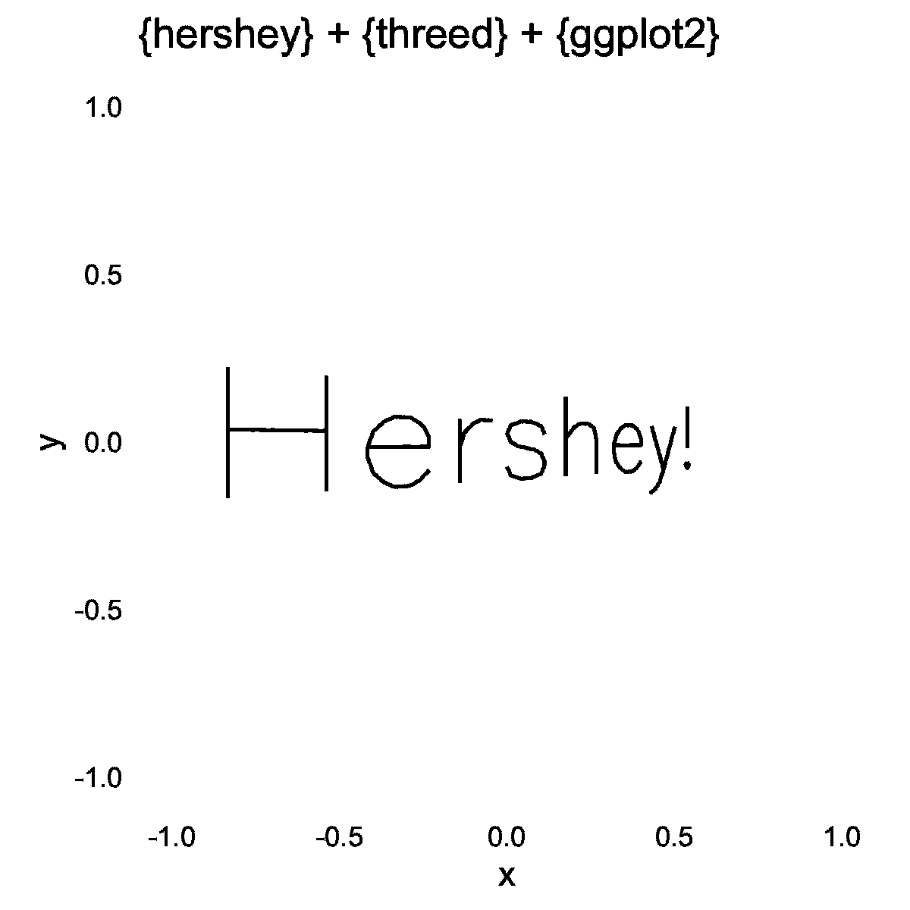

```{r, include = FALSE}
knitr::opts_chunk$set(
  collapse = TRUE,
  comment = "#>"
)


library(hershey)
library(threed)
library(dplyr)
library(ggplot2)
```


The Hershey vector fonts are just collections of points and line segments. 

By applying a transformation to these coordinates and using a perspective projection, 
text can rotated in three dimensions.


```{r setup}
library(hershey)
library(threed)
library(dplyr)
library(ggplot2)
```


```{r out.width = "100%", fig.width = 8, fig.height = 3}
#~~~~~~~~~~~~~~~~~~~~~~~~~~~~~~~~~~~~~~~~~~~~~~~~~~~~~~~~~~~~~~~~~~~~~~~~~~~~~~
# Hershey fonts are just collections of points
#~~~~~~~~~~~~~~~~~~~~~~~~~~~~~~~~~~~~~~~~~~~~~~~~~~~~~~~~~~~~~~~~~~~~~~~~~~~~~~
kapow_orig <- hershey::create_string_df("Hershey!", 'futural')

ggplot(kapow_orig, aes(x, y, group=interaction(char_idx, stroke))) + 
  geom_point() + 
  geom_path() + 
  theme_minimal() + 
  coord_equal()
```


```{r eval=FALSE}
#~~~~~~~~~~~~~~~~~~~~~~~~~~~~~~~~~~~~~~~~~~~~~~~~~~~~~~~~~~~~~~~~~~~~~~~~~~~~~~
# Add a z-coordinate
#~~~~~~~~~~~~~~~~~~~~~~~~~~~~~~~~~~~~~~~~~~~~~~~~~~~~~~~~~~~~~~~~~~~~~~~~~~~~~~
kapow_mat <- kapow_orig %>% 
  mutate(stroke = as.numeric(stroke)) %>%
  select(x, y) %>%
  mutate(z = 0, s = 1, x = x - 45) %>%
  mutate(x = x/20, y = y/20) %>%
  as.matrix() 


#~~~~~~~~~~~~~~~~~~~~~~~~~~~~~~~~ ~~~~~~~~~~~~~~~~~~~~~~~~~~~~~~~~~~~~~~~~~~~~~~
# Transform the text and render 
#~~~~~~~~~~~~~~~~~~~~~~~~~~~~~~~~~~~~~~~~~~~~~~~~~~~~~~~~~~~~~~~~~~~~~~~~~~~~~~
create_transformed_text_plot <- function(rx, ry = rx + 30, rz = 2 * rx) {
  kapow_new <- kapow_mat %>% 
    threed::rotate_by(rx * pi/180, c(1, 0, 0)) %>%
    threed::rotate_by(ry * pi/180, c(0, 1, 0)) %>%
    threed::rotate_by(rz * pi/180, c(0, 0, 1)) %>%
    threed::translate_by(c(0, 0, -4)) %>%
    threed::perspective_projection(f = 10) %>%
    identity()
  
  kapow   <- kapow_orig
  kapow$x <- kapow_new[, 1]
  kapow$y <- kapow_new[, 2]
  
  ggplot(kapow, aes(x, y, group=interaction(char_idx, stroke))) + 
    geom_path() +
    theme_minimal() + 
    theme(line = element_blank()) + 
    coord_equal(xlim = c(-1, 1), ylim = c(-1, 1)) +
    labs(title = "{hershey} + {threed} + {ggplot2}") + 
    NULL
}


#~~~~~~~~~~~~~~~~~~~~~~~~~~~~~~~~~~~~~~~~~~~~~~~~~~~~~~~~~~~~~~~~~~~~~~~~~~~~~~
# Generate a sequence of frames and save
#~~~~~~~~~~~~~~~~~~~~~~~~~~~~~~~~~~~~~~~~~~~~~~~~~~~~~~~~~~~~~~~~~~~~~~~~~~~~~~
angles <- head(seq(0, 360, length.out = 100), -1)
for (ii in seq_along(angles)) {
  p <- create_transformed_text_plot(rx = angles[ii])
  
  filename <- sprintf("threed/%03i.png", ii)
  ggsave(filename, p, width = 4, height = 4)
}
```


```{r echo = FALSE, eval = FALSE}
system("convert -delay 10 threed/*.png threed/anim.gif")
system("gifsicle threed/anim.gif --colors 2 > threed/animo.gif")
```




